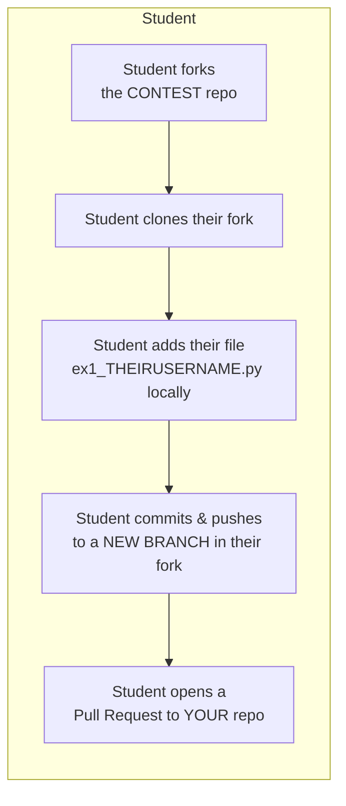
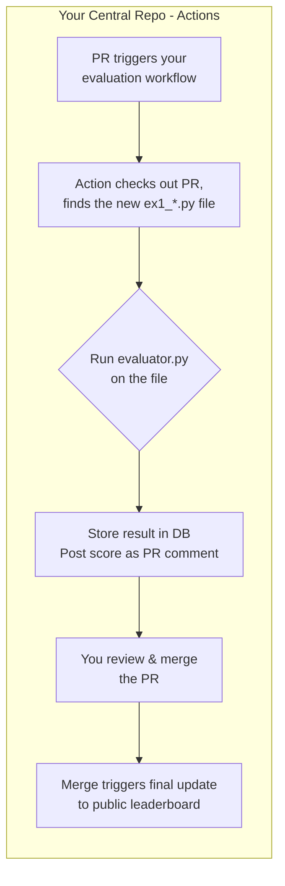

## Test GitHub actions with docker

### Repo structure

```text
.github/workflows/
├── grade-pr.yml           # Grades each PR submission
├── update-leaderboard.yml # Updates DB & leaderboard after merge
└── build-image.yml        # OPTIONAL: Manual rebuild of Docker image
docker/
└── Dockerfile             # Minimal Docker image for evaluation
evaluator.py               # Main grading script
generate_page.py           # Leaderboard generator
requirements.txt           # Python dependencies (optional)
```

### Repo creation from scratch (not tested)
```bash
git init 
git add .
git commit -m "Initial setup"
git branch -M main
git remote add origin https://github.com/YOUR_USERNAME/YOUR_REPO.git
git push -u origin main
```

### Repo creation (after empty repo creation on GitHub and cloning)
```bash
git add .
git commit -m "Initial setup"
git push
```

### Principle

On the student side, first fork and clone the main repo, then use Pull Request (PR) each time you want to submit your work : 

**Note:** Replace `YOURUSERNAME` in the filename with your actual GitHub username (e.g., `ex1_johndoe.py`).

The central will then analyze you work (after your PR) and display the results (with GitHub actions) :

